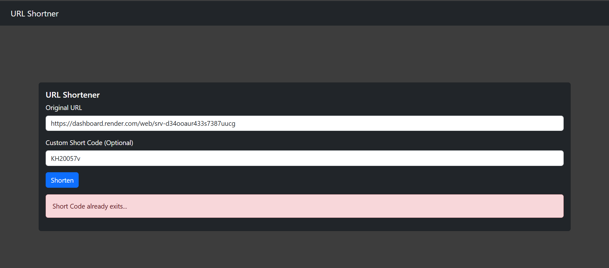

# URL-Shortener_FastAPI-React

[](https://github.com/Kasa-Harendra/URL-Shortner_FastAPI-React/commits/master)
[](https://github.com/Kasa-Harendra/URL-Shortner_FastAPI-React/graphs/contributors)
[](https://opensource.org/licenses/MIT) <!-- Assuming MIT License, common for open-source projects -->

## Description

This project is a full-stack URL shortening application, meticulously crafted with a powerful FastAPI backend and a dynamic React frontend. It provides users with a seamless experience to convert long, cumbersome URLs into short, memorable links. The application supports custom short codes, tracks click counts, and efficiently redirects users to their original destinations. Utilizing a lightweight SQLite database for data persistence via SQLModel, it offers a robust yet easy-to-deploy solution for URL management.

**LIVE APP**: [https://url-shortner-ud4q.onrender.com](https://url-shortner-ud4q.onrender.com)

## Features

*   **URL Shortening**: Effortlessly transform long URLs into concise, shareable short links.
*   **Custom Short Codes**: Users can define their own preferred short code for a URL, subject to availability.
*   **Automatic Short Code Generation**: If no custom code is provided, a unique and random short code is automatically generated.
*   **URL Redirection**: Seamlessly redirects users from the short URL to the original long URL.
*   **FastAPI Backend**: Built with FastAPI for high performance, automatic interactive API documentation (Swagger UI/ReDoc), and robust RESTful API development.
*   **React Frontend**: A modern, responsive, and user-friendly interface developed with React, providing an intuitive experience for shortening URLs.
*   **CORS Enabled**: Configured to handle Cross-Origin Resource Sharing, allowing the frontend to communicate securely with the backend.

## Technologies Used

*   **Backend**:
    *   [Python](https://www.python.org/)
    *   [FastAPI](https://fastapi.tiangolo.com/)
    *   [Uvicorn](https://www.uvicorn.org/)
    *   [PyMongo](https://pymongo.readthedocs.io/en/stable/)
    *   [python-dotenv](https://pypi.org/project/python-dotenv/)
*   **Frontend**:
    *   [React](https://react.dev/)
    *   [Vite](https://vitejs.dev/)
    *   [JavaScript](https://developer.mozilla.org/en-US/docs/Web/JavaScript)
    *   [Axios](https://axios-http.com/)
    *   [React Router DOM](https://reactrouter.com/en/main)
    *   [CSS](https://developer.mozilla.org/en-US/docs/Web/CSS)

## Installation

To get this project up and running, you'll need to set up both the backend (FastAPI) and the frontend (React).

### Prerequisites

Make sure you have the following installed on your system:

*   **Python 3.8+**
*   **pip** (Python package installer)
*   **Node.js 14+**
*   **npm** (Node.js package manager)

### Backend Setup

1.  **Clone the repository**:
    ```bash
    git clone https://github.com/Kasa-Harendra/URL-Shortner_FastAPI-React.git
    cd URL-Shortner_FastAPI-React
    ```

2.  **Navigate to the backend directory**:
    ```bash
    cd backend
    ```

3.  **Create a virtual environment** (recommended):
    ```bash
    python -m venv venv
    source venv/bin/activate  # On Windows: venv\Scripts\activate
    ```

4.  **Install backend dependencies**:
    ```bash
    pip install -r requirements.txt
    ```

5.  **Run the backend server**:
    ```bash
    uvicorn main:app --reload --host 0.0.0.0 --port 8000
    ```
    The backend API will now be running at `http://localhost:8000`. You can access the API documentation (Swagger UI) at `http://localhost:8000/docs`.

### Frontend Setup

1.  **Navigate to the frontend directory**:
    *(Assuming you are in the root directory `URL-Shortner_FastAPI-React`)*
    ```bash
    cd frontend
    ```

2.  **Install frontend dependencies**:
    ```bash
    npm install
    ```

3.  **Run the frontend development server**:
    ```bash
    npm run dev
    ```
    The frontend application will typically open in your browser at `http://localhost:5173` (or another port as indicated by Vite).

### Running Both (Production-like)

The `build.sh` script provides a way to build the frontend and then run the backend, simulating a combined deployment:

1.  **Ensure you are in the root directory of the project**:
    ```bash
    cd URL-Shortner_FastAPI-React
    ```

2.  **Make the script executable and run it**:
    ```bash
    chmod +x build.sh
    ./build.sh
    ```
    This script will:
    *   Navigate to the `frontend` directory.
    *   Install frontend dependencies (`npm install`).
    *   Build the React application for production (`npm run build`).
    *   Navigate back to the root directory.
    *   Install backend dependencies (`pip install -r backend/requirements.txt`).
    *   Start the FastAPI backend with Uvicorn on `http://0.0.0.0:8000`.

    **Note**: When running with `build.sh`, the frontend build artifacts will be generated in `frontend/dist`. You would typically serve these static files separately (e.g., using Nginx or by integrating them into the FastAPI app as static files), or use a service like Netlify/Vercel for the frontend. The `build.sh` script currently just builds the frontend and then starts the backend.

## Usage

Once both the backend and frontend servers are running:

1.  **Access the Frontend**: Open your web browser and navigate to the frontend URL (e.g., `http://localhost:5173`).
2.  **Shorten a URL**:
    *   On the homepage, you will see an input field for "Long URL". Enter the URL you wish to shorten.
    *   Optionally, you can provide a "Custom Short Code" in the designated input field.
    *   Click the "Shorten URL" button.
    *   The generated short URL will be displayed on the page. You can copy it directly.
3.  **Redirecting**:
    *   When a user accesses a short URL (e.g., `http://localhost:8000/YOUR_SHORT_CODE`), the backend will redirect them to the original long URL.
    *   The `RedirectPage.jsx` component in the frontend handles this by making an API call to the backend's redirect endpoint.

## Project Structure

```
.
├── backend/            
│   ├── db.py                    # Database connection and session management
│   ├── main.py                  # FastAPI application entry point, CORS setup
│   ├── models.py                # URL Model for data validation
│   ├── requirements.txt         # Python dependencies
│   ├── router.py                # FastAPI routes for shortening, redirection, admin
│   ├── schemas.py               # Pydantic/MongoDBModel schemas for data validation
│   └── utils.py                 # Utility functions (e.g., short code generation)
├── build.sh                     # Script to build frontend and run backend
├── frontend/
│   ├── public/                  # Static assets (e.g., vite.svg)
│   ├── src/
│   │   ├── assets/              # Frontend static assets (e.g., react.svg)
│   │   ├── components/
│   │   │   └── NavigationBar.jsx  # Navigation bar component
│   │   ├── pages/
│   │   │   ├── HomePage.jsx     # Main page for URL shortening
│   │   │   └── RedirectPage.jsx # Page for handling redirects
│   │   ├── App.css              # Global application styles
│   │   ├── App.jsx              # Main React component, defines routes
│   │   ├── index.css            # Root CSS
│   │   └── main.jsx             # React app entry point
│   ├── .eslintrc.cjs            # ESLint configuration
│   ├── index.html               # Main HTML file for React app
│   ├── package-lock.json        # npm package lock file
│   ├── package.json             # Frontend dependencies and scripts
│   └── vite.config.js           # Vite configuration
└── README.md
```

## Contribution Guidelines

We welcome contributions to this project! If you'd like to contribute, please follow these guidelines:

1.  **Fork the repository**: Start by forking the `URL-Shortner_FastAPI-React` repository to your GitHub account.
2.  **Create a new branch**: For each new feature or bug fix, create a new branch from `master`.
    ```bash
    git checkout -b feature/your-feature-name
    ```
    or
    ```bash
    git checkout -b bugfix/issue-description
    ```
3.  **Make your changes**: Implement your changes, ensuring they adhere to the project's coding style and conventions.
4.  **Test your changes**: Before submitting a pull request, thoroughly test your modifications to ensure they work as expected and don't introduce new issues.
5.  **Commit your changes**: Write clear, concise commit messages that explain the purpose of your changes.
    ```bash
    git commit -m "feat: Add new feature for X"
    ```
    or
    ```bash
    git commit -m "fix: Resolve bug in Y"
    ```
6.  **Push to your fork**: Push your changes to your forked repository.
    ```bash
    git push origin feature/your-feature-name
    ```
7.  **Create a Pull Request**: Go to the original repository on GitHub and open a new pull request from your forked branch to the `master` branch. Provide a detailed description of your changes.

## Screenshots/Examples

**User Interface**: 





---
**Repository Link**: [https://github.com/Kasa-Harendra/URL-Shortner_FastAPI-React](https://github.com/Kasa-Harendra/URL-Shortner_FastAPI-React)
